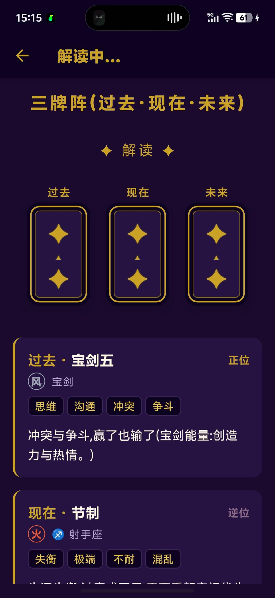

<div align="center">


# ✦ 塔罗占卜 · Tarot ✦

**让直觉为你揭晓答案** 🔮

一款用 React Native 打造的中文塔罗牌占卜 App —— 78 张经典 Rider-Waite-Smith 牌图、6 种牌阵、本地历史,还能把牌阵一键整理成文本喂给任意 AI 做深度解读。

<br/>


[](https://github.com/shaozheng0503/tarot-android/stargazers)
[](https://github.com/shaozheng0503/tarot-android/commits/main)
[](https://github.com/shaozheng0503/tarot-android/pulls)

<sub>🌙 每一次抽牌,都是与直觉的一次对话 🌙</sub>

</div>

---

## 📑 目录

- [✨ 为什么是它](#-为什么是它)
- [📸 截图](#-截图)
- [🃏 功能详解](#-功能详解)
- [📲 下载与安装](#-下载与安装)
- [🛠️ 技术栈](#️-技术栈)
- [🏛️ 架构设计](#️-架构设计)
- [🚀 本地运行与构建](#-本地运行与构建)
- [🎨 自定义](#-自定义)
- [🧪 测试](#-测试)
- [🗺️ 路线图](#️-路线图)
- [📜 牌库与版权](#-牌库与版权)
- [🤝 贡献](#-贡献)
- [🙏 致谢](#-致谢)
- [📄 License](#-license)

---

## ✨ 为什么是它

> 大多数塔罗 App 要么解读是死板的固定文案,要么把你锁在它自己的付费 AI 里。

这款 App 的思路不一样 —— **它是最好的「牌阵生成器 + AI 素材源」**:

🔮 **仪式感的抽牌体验**:洗牌动效、逐张翻牌、震动反馈,78 张原汁原味的 RWS 牌面
📋 **一键复制成结构化文本**:问题 + 牌阵 + 每张牌的位置 / 正逆位 / 元素 / 关键词 / 释义,**开头自带塔罗师 Prompt**,粘进任意 AI 直接出高质量解读 —— 比截图更准、更全
🌙 **完全本地**:历史记录、每日一卡全部存在本地,零账号、零网络、零追踪
🃏 **像本塔罗辞典**:内置 78 张牌的图鉴,可随时翻阅学习

---

## 📸 截图

<div align="center">



<sub>三牌阵 · 过去 / 现在 / 未来 —— 每张牌带元素、占星、关键词与释义</sub>

</div>

> 💡 想补齐更多截图?在新版 App 上截图后,把文件丢进 `docs/screenshots/`(建议命名 `home.png` / `library.png` / `daily.png` / `card-detail.png`),README 会自动展示。

---

## 🃏 功能详解

### 🔮 6 种牌阵

| 牌阵 | 张数 | 用途 |
|---|:---:|---|
| **单牌指引** | 1 | 快速问答,获得当下指引 |
| **三牌阵** | 3 | 过去 · 现在 · 未来,看事情脉络 |
| **关系之镜** | 3 | 你 · 对方 · 关系,照见一段关系 |
| **现状·阻碍·建议** | 3 | 解决具体难题 |
| **五牌星形** | 5 | 现状 / 挑战 / 行动 / 外部影响 / 结果 |
| **凯尔特十字** | 10 | 经典深度牌阵,全面剖析议题 |

牌阵布局自适应:单张居中、三张横排、多张网格,翻牌瀑布随张数自动调节节奏。

### 🎴 真实牌面 + 程序化兜底

- **78 张经典 Rider-Waite-Smith 牌图**(大阿卡纳 22 + 小阿卡纳 56,小牌为完整插画场景)
- 翻牌用**绕竖轴的 scaleX 翻转**,真实牌图必定显示(不依赖 `backfaceVisibility`,规避部分 Android 的背面剔除问题)
- **逆位自动旋转 180°** 呈现,逆位概率 30%(贴近传统占卜,而非对半)
- 万一缺图,自动回退到程序化牌面(花色 pip 点阵 ♠♥♦♣ + 占星符号),**永不开天窗**

### 🌗 元素与占星

每张牌都标注 **四元素**(火 / 水 / 风 / 土)与 **占星对应**:
- 大阿卡纳 → 行星 / 星座(Golden Dawn 体系,如 太阳 ☉、恋人 ♊ 双子座)
- 小阿卡纳 → 花色元素(权杖火 / 圣杯水 / 宝剑风 / 星币土)

### 📋 一键复制 / 分享给 AI（招牌功能）

把整次占卜整理成结构化纯文本,**开头自带角色化 Prompt**:

```
你是一位经验丰富、温暖而诚实的塔罗师。请结合我的问题,逐张解读下面这个牌阵……

✦ 塔罗占卜 · 三牌阵(过去·现在·未来)
问题:我最近的工作会顺利吗?

1. [过去] 宝剑五(正位)
   元素/占星:风 · 宝剑
   关键词:思维、沟通、冲突、争斗
   牌意:冲突与争斗,赢了也输了……
...
```

复制后粘进任意 AI App,**无需截图 OCR**,直接得到个性化深度解读。

### 🌙 每日一卡

首页「今日运势」入口,按日期**确定性抽牌**(同一天结果固定),翻开后自动归档到历史。

### 📖 牌库图鉴

独立 Tab,按大阿卡纳 + 四花色浏览全部 78 张;点进单卡详情看**正位 / 逆位完整释义**,可单独复制喂给 AI 学习。

### 🗂️ 本地历史

每次抽牌(含每日一卡)自动保存,最多 500 条;支持**长按删除单条** / 详情页删除 / 一键清空。

### ♿ 无障碍 & 健壮性

- 牌面带 `accessibilityLabel`,读屏可朗读牌名 / 正逆位 / 元素
- 尊重系统「减少动效」设置,自动关闭翻牌 / 呼吸等动画
- `ErrorBoundary` 兜底渲染异常,不会整屏白屏

---

## 📲 下载与安装

目前以本地构建为主(见 [本地运行与构建](#-本地运行与构建))。构建产物为按 ABI 分包的 release APK:

| APK | 适用 |
|---|---|
| `app-arm64-v8a-release.apk` | ⭐ 绝大多数现代手机(2017 年后) |
| `app-universal-release.apk` | 通用包,任何设备 / 模拟器 |

安装:
```bash
adb install -r app-arm64-v8a-release.apk
# 或:手机上开启「未知来源」后点开 APK 安装
```

> release 包以 debug key 签名,**自用 / 学习 / 侧载无虞**;上架应用商店需替换为正式 keystore。

---

## 🛠️ 技术栈

| 层 | 选型 | 说明 |
|---|---|---|
| 框架 | **React Native 0.85** | New Architecture + Hermes |
| 语言 | **TypeScript 5.8**(strict) | 全量类型安全 |
| 导航 | **React Navigation 7** | Stack + Bottom Tabs(占卜 / 图鉴 / 历史) |
| 状态 | **Zustand 5** | 轻量,3 行搞定一个 store |
| 持久化 | **AsyncStorage** | 历史记录 / 每日一卡 |
| 动画 | **Reanimated 4 + Worklets** | 60fps,UI 线程驱动 |
| 触感 | **Haptic Feedback** | 抽牌 / 翻牌震动 |
| 剪贴板 | **@react-native-clipboard/clipboard** | 一键复制,失败自动降级系统分享 |
| 牌图 | **Rider-Waite-Smith**(MIT 数据集) | 见 [牌库与版权](#-牌库与版权) |

---

## 🏛️ 架构设计

```
src/
├── components/        # CardView(scaleX 翻牌)/ SpreadLayout / Interpretation
│                      # ShareActions / DailyBanner / ErrorBoundary / CardBack ...
├── screens/           # Home / Reading / Daily / CardLibrary / CardDetail
│                      # History / HistoryDetail
├── navigation/        # RootNavigator(Stack + Tabs)
├── store/             # useHistoryStore / useDailyStore(Zustand + persist)
├── data/              # cards(78 张元数据)/ correspondences(元素占星)
│                      # spreads(牌阵)/ cardImages(id→真图 require 映射)
├── hooks/             # useReduceMotion
├── utils/             # shuffle / dailyCard(确定性)/ formatReading / share
├── theme/             # 紫黑金主题色 + 间距 + 字号
└── types/             # 全局类型
```

**数据流**:`HomeScreen` 选牌阵 → `ReadingScreen` 洗牌 / 翻牌 / 抽牌 → 写入 `useHistoryStore`(AsyncStorage 持久化)→ `HistoryScreen` 复盘。每日一卡由 `dailyCard.ts` 按日期哈希确定性抽出,`useDailyStore` 记录"今日已翻"。

**抽牌算法**:Fisher-Yates 洗牌 → 抽 N 张 → 每张独立判定正逆位(30%)。

---

## 🚀 本地运行与构建

### 环境要求

| 工具 | 版本 |
|---|---|
| Node | ≥ 22.11 |
| JDK | 17 |
| Android SDK | Platform 36 + Build-Tools 36 |
| NDK | 27.1.12297006 |
| CMake | 3.22.1 |

### 跑起来

```bash
git clone https://github.com/shaozheng0503/tarot-android.git
cd tarot-android
npm install

npm start            # 终端 A:Metro
npm run android      # 终端 B:构建并安装到设备/模拟器
```

### 打 release APK

```bash
cd android
./gradlew assembleRelease
# 产物:android/app/build/outputs/apk/release/*.apk
```

> 首次构建会下载 Gradle + 编译大量 C++(新架构),约 5–25 分钟;后续增量构建 1 分钟内。

---

## 🎨 自定义

### 重新生成应用图标

```bash
node scripts/gen-icon.mjs   # 深紫底 + 金色四角星,各密度 + 自适应图标
```

### 刷新 / 更换牌图

```bash
node scripts/fetch-rws.mjs  # 下载 78 张并生成 src/data/cardImages.ts 映射
```

换牌图源:改 `scripts/fetch-rws.mjs` 里的 `BASE` 与命名映射即可。`CardView` 优先用真图,缺图自动回退程序化牌面。

### 加新牌阵

在 `src/data/spreads.ts` 追加定义、在 `src/types/index.ts` 的 `SpreadType` 加入对应字面量即可,首页和布局会自动适配。

---

## 🧪 测试

```bash
npm test
```

覆盖纯函数(洗牌公平性 / 每日一卡确定性 / 文本格式化 / 图鉴分组 / 78 张牌图全覆盖)、Zustand store(500 上限 / 删除 / 清空)、组件渲染。当前 **4 套件 19 用例全过**。

---

## 🗺️ 路线图

- [x] v0.1 · 单牌 + 三牌阵 + 78 牌库 + 本地历史
- [x] v0.2 · 6 种牌阵 + 元素与占星对应
- [x] v0.3 · 每日一卡 + 一键复制/分享(自带 AI Prompt)
- [x] v0.4 · 牌库图鉴 + 历史单条删除 + 无障碍/减少动效/ErrorBoundary + 测试
- [x] v0.5 · 真实 RWS 牌图 + 专属应用图标 + scaleX 翻牌
- [ ] v0.6 · 占卜笔记 / 复盘 + 每日一卡连续打卡
- [ ] v0.7 · 每日一卡本地通知(需 `@notifee/react-native`)
- [ ] v0.8 · 分享成图(海报导出)+ 真实凯尔特十字交叉布局
- [ ] v0.9 · 多语言(英 / 繁)+ 设置页(逆位概率 / 触感 / Prompt 模板)
- [ ] v1.0 · 亮 / 暗主题切换 + 应用商店上架

---

## 📜 牌库与版权

- **牌面元数据**(中文名 / 关键词 / 释义)为原创翻译与释义,MIT 开源。
- **牌面图像**为 Rider-Waite-Smith(1909,Arthur Edward Waite 设计、Pamela Colman Smith 绘画),经 `scripts/fetch-rws.mjs` 从 [metabismuth/tarot-json](https://github.com/metabismuth/tarot-json)(MIT)拉取。

> ⚠️ RWS **1909 原版**在美、英等地已属公有领域;但本仓库所用扫描带「© 1971 U.S. Games」重新上色版标记 —— 该版本上色有独立版权。**个人 / 学习无虞**,**商业上架前**请改用 1909 公有领域来源(如耶鲁 Beinecke 扫描)或明确 CC0 的牌图包,并咨询当地法律意见。

---

## 🤝 贡献

欢迎任何形式的贡献!🌟

1. Fork 本仓库
2. `git checkout -b feature/awesome`
3. 提交前跑 `npx tsc --noEmit && npm run lint && npm test`
4. 提交 PR,描述你的改动

🐛 Bug / 💡 想法 / ❓ 疑问,都欢迎开 [Issue](https://github.com/shaozheng0503/tarot-android/issues)。

---

## 🙏 致谢

- **Arthur Edward Waite** & **Pamela Colman Smith** —— 经典 RWS 牌组的灵魂
- [**metabismuth/tarot-json**](https://github.com/metabismuth/tarot-json) —— 整理好的 RWS 牌图数据集
- **React Native** 团队与所有开源依赖作者

---

## 📄 License

[MIT](LICENSE) © 2026 shaozheng0503

<div align="center">

<br/>

✦ 如果它帮你听见了直觉的声音,欢迎点一颗 Star ⭐ ✦

<sub>🔮 抽牌只是开始,答案一直在你心里 🔮</sub>

</div>
